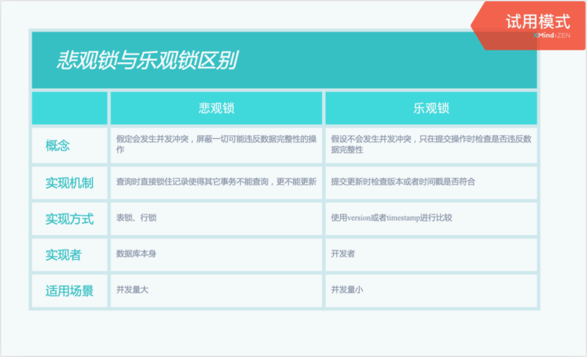

[TOC]

#### 1. 为什么一定要开启事务之后才能对数据库数据进行操作

> 事物保证数据库中数据的完整和安全，当[不同](http://wp1i.cn/tag/124)用户同时对同一条数据操作时事物[可以](http://wp1i.cn/tag/158)保证数据的完整性一致性。

#### 2. 定义

> 数据库的**事务（Transaction）**是一种机制、一个操作序列，包含了一组数据库操作命令。事务把所有的命令作为一个整体一起向系统提交或撤销操作请求，即这一组数据库命令要么都执行，要么都不执行，因此事务是一个不可分割的工作逻辑单元。

#### 3. 特性ACID

4 个特性，即原子性（Atomicity）、一致性（Consistency）、隔离性（Isolation）和持久性（Durability），这 4 个特性通常简称为 ACID

+ 原子性：事务是一个完整的操作。事务的各元素是不可分的（原子的）。事务中的所有元素必须作为一个整体提交或回滚。如果事务中的任何元素失败，则整个事务将失败。

+ 一致性： 当事务完成时，数据必须处于一致状态。也就是说，在事务开始之前，数据库中存储的数据处于一致状态。在正在进行的事务中. 数据可能处于不一致的状态，如数据可能有部分被修改。然而，当事务成功完成时，数据必须再次回到已知的一致状态。通过事务对数据所做的修改不能损坏数据，或者说事务不能使数据存储处于不稳定的状态。

  + 隔离性：对数据进行修改的所有并发事务是彼此隔离的，这表明事务必须是独立的，它不应以任何方式依赖于或影响其他事务。修改数据的事务可以在另一个使用相同数据的事务开始之前访问这些数据，或者在另一个使用相同数据的事务结束之后访问这些数据。

+ 持久性：事务的持久性指不管系统是否发生了故障，事务处理的结果都是永久的。一个事务成功完成之后，它对数据库所作的改变是永久性的，即使系统出现故障也是如此。也就是说，一旦事务被提交，事务对数据所做的任何变动都会被永久地保留在数据库中。

+ 支持事务的存储引擎

  支持事务的存储引擎有 InnoDB 和 BDB，其中，InnoDB 存储引擎事务主要通过 UNDO 日志和 REDO 日志实现，MyISAM 存储引擎不支持事务。

+ 执行事务语法

  ```sql
  --开启事务
  begin;
  或
  start transaction;
  --提交事务
  commit;
  --回滚
  rollback;
  
  --查看是否开启自动提交事务
  show variables like '%autocommit%';
  --设置事务体骄傲模式
  SET autocommit = 0|1|ON|OFF;
  ```


#### 4. 事务隔离级别

​	[事务隔离](https://zhuanlan.zhihu.com/p/117476959)

​	InnoDB 引擎下，MyISAM 引擎是不支持事务

+ 概念

  | 问题       | 解释                                                         |
  | ---------- | ------------------------------------------------------------ |
  | 脏读       | 读到未提交的数据                                             |
  | 可重复读   | 在一个事务内，最开始读到的数据和事务结束前任意时刻读到的数据是一致的。针对update操作 |
  | 不可重复读 | 在一个事务内，不同时间读到的同一批数据不一致。受其他事务影响。针对数据更新 |
  | 幻读       | 一个事务中读到了其他事务提前提交的数据。针对insert操作       |

+ SQL 标准定义了四种隔离级别

  | 隔离级别（隔离强度逐渐增强，性能逐渐变差。）                 | 脏读   | 不可重复读 | 幻读   |
  | ------------------------------------------------------------ | ------ | ---------- | ------ |
  | 读未提交（READ UNCOMMITTED）                                 | 可能   | 可能       | 可能   |
  | 读提交 （READ COMMITTED）                                    | 不可能 | 可能       | 可能   |
  | 可重复读 （REPEATABLE READ）<font color="red">（MySQL默认隔离级别）</font> | 不可能 | 不可能     | 可能   |
  | 串行化 （SERIALIZABLE）                                      | 不可能 | 不可能     | 不可能 |

+ 隔离级别查看

  ```sql
  --查看隔离级别
  show variables like '%transaction_isolation%';
  select @@transaction_isolation;
  
  select @@tx_isolation;
  
  --设置隔离级别
  set [作用域] transaction isolation level [事务隔离级别]
  SET [SESSION | GLOBAL] TRANSACTION ISOLATION LEVEL {READ UNCOMMITTED | READ COMMITTED | REPEATABLE READ | SERIALIZABLE}
  
  --查看有多少事务在执行
  select * from information_schema.innodb_trx;
  ```

+ 事务的执行

  begin/start transaction -> 执行操作 ->commit/rollback

  begin命令不代表事务开始，事务开始于begin命令之后的第一条语句

#### 5. 事务隔离级别原理

​	MySQL 事务隔离其实是依靠锁来实现的，加锁自然会带来性能的损失。

+ 读未提交

  读未提交隔离级别是不加锁的，所以它的性能是最好的，没有加锁、解锁带来的性能开销。任何事务对数据的修改都会第一时间暴漏给其他事务。脏读都解决不了

+ 读提交

  读提交就是一个事务只能读到其他事务已经提交过的数据，也就是其他事务调用 commit 命令之后的数据。

  每个 select 语句都有自己的一份快照，而不是一个事务一份，所以在不同的时刻，查询出来的数据可能是不一致的。

+ 可重复读

  可重复读是指，事务不会读到其他事务对已有数据的修改，及时其他事务已提交，也就是说，事务开始时读到的已有数据是什么，在事务提交前的任意时刻，这些数据的值都是一样的。但是，对于其他事务新插入的数据是可以读到的，这也就引发了幻读问题。

  <font color=red> MVVC (多版本并发控制) </font>

  数据库表中看到的一行记录可能实际上有多个版本，每个版本的记录除了有数据本身外，还要有一个表示版本的字段，记为 row trx_id，而这个字段就是使其产生的事务的 id，事务 ID 记为 transaction id，它在事务开始的时候向事务系统申请，按时间先后顺序递增。

  可重复读是在事务开始的时候生成一个当前事务全局性的快照(<font color=red>一致性视图</font>)，而读提交则是每次执行语句的时候都重新生成一次快照。

  对于一个快照来说，它能够读到那些版本数据，要遵循以下规则：

  1. 当前事务内的更新，可以读到；
  2. 版本未提交，不能读到；
  3. 版本已提交，但是却在快照创建后提交的，不能读到；
  4. 版本已提交，且是在快照创建前提交的，可以读到；

  **并发写**
  update 的时候要对所修改的行加行锁，这个行锁会在提交之后才释放。

  例子：事务A执行 update 操作， update 的时候要对所修改的行加行锁，这个行锁会在提交之后才释放。而在事务A提交之前，事务B也想 update 这行数据，于是申请行锁，但是由于已经被事务A占有，事务B是申请不到的，此时，事务B就会一直处于等待状态，直到事务A提交，事务B才能继续执行，如果事务A的时间太长，那么事务B很有可能出现超时异常。

  加锁的过程要分有索引和无索引两种情况:

  ```sql
  update user set age=11 where id = 1
  ```

  id 是这张表的主键，是有索引的情况，那么 MySQL 直接就在索引数中找到了这行数据，然后干净利落的加上行锁就可以了。而下面这条语句

  ```mysql
  update user set age=11 where age=10
  ```

  **表中并没有为 age 字段设置索引，所以， MySQL 无法直接定位到这行数据。那怎么办呢，当然也不是加表锁了。MySQL 会为这张表中所有行加行锁，没错，是所有行。但是呢，在加上行锁后，MySQL 会进行一遍过滤，发现不满足的行就释放锁，最终只留下符合条件的行。虽然最终只为符合条件的行加了锁，<font color=red>但是这一锁一释放的过程对性能也是影响极大的。</font>**所以，如果是大表的话，建议合理设计索引，如果真的出现这种情况，那很难保证并发度。

  **解决幻读**

  MySQL 已经在可重复读隔离级别下解决了幻读的问题。

  并发写问题的解决方式就是行锁，而解决幻读用的也是锁，叫做间隙锁，MySQL 把行锁和间隙锁合并在一起，解决了并发写和幻读的问题，这个锁叫做 Next-Key锁。

+ 串行化

  相当于单线程，后一个事务的执行必须等待前一个事务结束。

  **<font color=red>读的时候加共享锁</font>，也就是其他事务可以并发读，但是不能写。<font color=red>写的时候加排它锁</font>，其他事务不能并发写也不能并发读。**


#### 6. 事务使用注意

+ 事务尽可能简短（事务的开启到结束会在数据库管理系统中保留大量资源，以保证事务的原子性、一致性、隔离性和持久性。如果在多用户系统中，较大的事务将会占用系统的大量资源，使得系统不堪重负，会影响软件的运行性能）
+ 事务中访问的数据量尽量最少
+ 查询数据时尽量不要使用事务
+ 事务处理过程中不要出现等待用户输入的操作

#### 7. 锁

+ 乐观锁：

  乐观锁不是数据库自带的，需要我们自己去实现。乐观锁是指操作数据库时(更新操作)，想法很乐观，认为这次的操作不会导致冲突，在操作数据时，并不进行任何其他的特殊处理（也就是不加锁），而在进行更新后，再去判断是否有冲突了。

+ 悲观锁

  悲观锁就是在操作数据时，认为此操作会出现数据冲突，所以在进行每次操作时都要通过获取锁才能进行对相同数据的操作，这点跟java中的synchronized很相似，所以悲观锁需要耗费较多的时间

  + 共享锁

    共享 (S) 用于不更改或不更新数据的操作（只读操作），如 SELECT 语句。

    如果事务T对数据A加上共享锁后，则其他事务只能对A再加共享锁，不能加排他锁。获准共享锁的事务只能读数据，不能修改数据。

  + 排他锁

    用于数据修改操作，例如 INSERT、UPDATE 或 DELETE。确保不会同时同一资源进行多重更新。

    如果事务T对数据A加上排他锁后，则其他事务不能再对A加任任何类型的封锁。获准排他锁的事务既能读数据，又能修改数据。

+ 悲观锁和乐观锁区别

  

#### 8. MySQL运维工具：

记录死锁信息：pt-deadlock-logger[percona-toolkit 之 【pt-deadlock-logger】说明](https://www.cnblogs.com/zhoujinyi/p/3392800.html)

#### 9. MySQL锁机制脑图


#### 10. 针对MySQL锁机制的优化

1. InnoDB的行锁是基于索引实现的，如果不通过索引访问数据，InnoDB会使用表锁。 **（是否使用索引来检索数据是由MySQL通过判断不同执行计划的代价来决 定的，如果MySQL认为全表扫描效率更高，比如对一些很小的表，它就不会使用索引，这种情况下InnoDB将使用表锁，而不是行锁。）**
2. 尽可能减少索引条件，避免间隙锁。
3. 尽量用相等条件（等值查询）访问数据，这样可以避免间隙锁对并发插入的影响；**（尽量使用相等条件来访问更新数据，避免使用范围条件 间隙锁Next-Key锁）**
4. 选择合理的事务大小，小事务发生锁冲突的几率也更小；
5. 不同的程序访问一组表时，应尽量约定以相同的顺序访问各表，对一个表而言，尽可能以固定的顺序存取表中的行。这样可以大大减少死锁的机会；
6. 给记录集显式加锁时，最好一次性请求足够级别的锁。

避免死锁：

7. 加锁顺序一致，尽可能一次性锁定所需行数。
8. 单词操作数量不宜过多，涉及表尽量少。
9. 尽量使用相同条件访问数据，这样可以避免间隙锁对并发的插入影响。