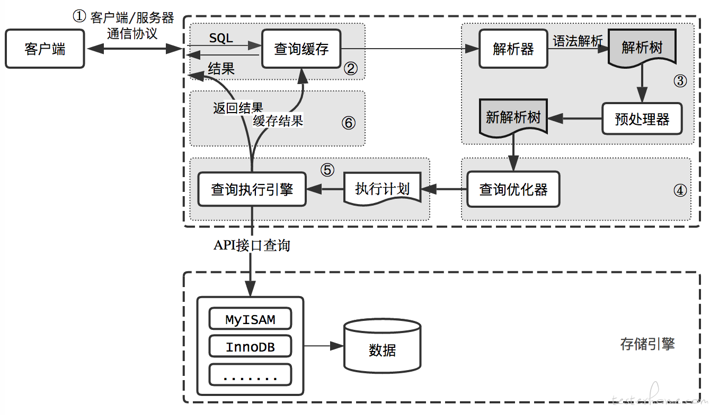

[TOC]

#### 1. count(1)、count(*)、count(字段)区别

+ count(字段)不统计字段为null（进行全表扫描，判断指定字段的值是否为`NULL`，不为`NULL`则累加）

+ count(1)和count(*)统计全部记录数

+ InnoDB中`COUNT(*)`和`COUNT(1)`实现上没有区别，而且效率一样（依旧建议使用`count(*)`，因为这是SQL92定义的标准统计行数的语法。），但是`COUNT(字段)`需要进行字段的非NULL判断，所以效率会低一些

  ```sql
  InnoDB handles SELECT COUNT(*) and SELECT COUNT(1) operations in the same way. There is no performance difference.
  ```

+ 对count(*)的优化（MyISAM、InnoDB两种存储引擎对比）

  + **MyISAM不支持事务，MyISAM中的锁是表级锁；而InnoDB支持事务，并且支持行级锁。**

  + MyISAM做了一个简单的优化，把表的总行数单独记录下来，如果执行`count(*)`时可以直接返回，<font color='red'>前提是不能有where条件。</font>MyISAM是表级锁，不会有并发的行操作，所以查到的结果是准确的。

  + nnoDB不能使用这种缓存操作，因为支持事务，大部分操作都是行级锁，行可能被并行修改，那么缓存记录不准确。

    但是，InnoDB还是针对COUNT(*)语句做了些优化的。通过低成本的索引进行扫表，而不关注表的具体内容。

    InnoDB中索引分为聚簇索引（主键索引）和非聚簇索引（非主键索引），聚簇索引的叶子节点中保存的是整行记录，而非聚簇索引的叶子节点中保存的是该行记录的主键的值。**MySQL会优先选择最小的非聚簇索引来扫表。**<font color='red'>优化的前提是查询语句中不包含where条件和group by条件。</font>

#### 不推荐使用子查询和JOIN

1. 不推荐原因

   + 对于mysql，不推荐使用子查询和join是因为本身join的效率就是硬伤，一旦数据量很大效率就很难保证，强烈推荐分别根据索引单表取数据，然后在程序里面做join，merge数据。

   + 子查询就更别用了，效率太差，执行子查询时，MYSQL需要创建临时表，查询完毕后再删除这些临时表，所以，子查询的速度会受到一定的影响，这里多了一个创建和销毁临时表的过程。

   + 如果是JOIN的话，它是走嵌套查询的。小表驱动大表，且通过索引字段进行关联。如果表记录比较少的话，还是OK的。大的话业务逻辑中可以控制处理。

   + 数据库是最底层的，瓶颈往往是数据库。建议数据库只是作为数据store的工具，而不要添加业务上去。

2. 应用层关联优势
   - **让缓存的效率更高**。许多应用程序可以方便地缓存单表查询对应的结果对象。如果关联中的某个表发生了变化，那么就无法使用查询缓存了，而拆分后，如果某个表很少改变，那么基于该表的查询就可以重复利用查询缓存结果了。
   - 将查询分解后，执行单个查询可以**减少锁的竞争**。
   - 在应用层做关联，可以更容易对数据库进行拆分，更容易做到**高性能和可扩展**。（并发场景多，DB查询频繁，需要分库分表，可以将数据分布到不同的MySQL服务器上）
   - **查询本身效率也可能会有所提升**。查询id集的时候，使用IN（）代替关联查询，可以让MySQL按照ID顺序进行查询，这可能比随机的关联要更高效。
   - **可以减少冗余记录的查询**。在应用层做关联查询，意味着对于某条记录应用只需要查询一次，而在数据库中做关联查询，则可能需要重复地访问一部分数据。从这点看，这样的重构还可能会减少网络和内存的消艳。
   - 更进一步，这样做相当于在应用中实现了哈希关联，而不是使用MySQL的嵌套循环关联。某些场景哈希关联的效率要高很多。

3. 不推荐使用join原因

   + DB承担的业务压力大，能减少负担就减少。当表处于百万级别后，join导致性能下降； 
   + 分布式的分库分表。这种时候是不建议跨库join的。目前mysql的分布式中间件，跨库join表现不良。 
   + 修改表的schema，单表查询的修改比较容易，join写的sql语句要修改，不容易发现，成本比较大，当系统比较大时，不好维护。

   **解决方式**

   在业务层，单表查询出数据后，作为条件给下一个单表查询。也就是子查询。 会担心子查询出来的结果集太多。mysql对in的数量没有限制，但是mysql限制整条sql语句的大小。通过调整参数max_allowed_packet ，可以修改一条sql的最大值。建议在业务上做好处理，限制一次查询出来的结果集是能接受的。

   **好处**

   做分页查询：

   关联查询的好处时候可以做分页，可以用副表的字段做查询条件，在查询的时候，将副表匹配到的字段作为结果集，用主表去in它，但是问题来了，如果匹配到的数据量太大就不行了，也会导致返回的分页记录跟实际的不一样，解决的方法可以交给前端，一次性查询，让前端分批显示就可以了，这种解决方案的前提是数据量不太，因为sql本身长度有限

   

#### MYSQL子查询和JOIN连接哪个性能更好（待验证）

**JOIN**5.6小数据量没区别 5.7以上没测试

```sql
--EXPLAIN解析以下SQL的时候，MySQL报告了一个警告
EXPLAIN
SELECT t.* FROM test t WHERE t.id IN (SELECT t2.id FROM test t2 )
--显示警告发现子查询被编译为join语句
SHOW WARNINGS

select `test`.`t`.`id` AS `id`,`test`.`t`.`name` AS `name` 
from `test`.`test` `t2` join `test`.`test` `t` 
where (`test`.`t`.`id` = `test`.`t2`.`id`)
```

子查询被编译器优化成了join语句，所以使用子查询凭空增加了编译器的负担，在可以使用join的时候一定不要使用子查询


#### 创建临时表情况

[原文](https://blog.csdn.net/xiaolyuh123/article/details/53286033)

1、UNION查询；
2、用到TEMPTABLE算法或者是UNION查询中的视图；
3、ORDER BY和GROUP BY的子句不一样时；
4、表连接中，ORDER BY的列不是驱动表中的；
5、DISTINCT查询并且加上ORDER BY时；
6、SQL中用到SQL_SMALL_RESULT选项时；
7、FROM中的子查询；
8、子查询或者semi-join时创建的表；

EXPLAIN 查看执行计划结果的 Extra 列中，如果包含 [Using Temporary](http://imysql.com/2015/06/14/mysql-faq-what-important-information-in-explain.shtml) 就表示会用到临时表。

当然了，如果临时表中需要存储的数据量超过了上限（ [tmp-table-size](https://dev.mysql.com/doc/refman/5.6/en/server-system-variables.html#sysvar_tmp_table_size) 或 [max-heap-table-size](https://dev.mysql.com/doc/refman/5.6/en/server-system-variables.html#sysvar_max_heap_table_size) 中取其大者），这时候就需要生成基于磁盘的临时表了。


#### EXPLAIN解析SQL执行计划时

如果有下面几种情况，就需要特别关注下了：

1. 首先看下 type 这列的结果，如果有类型是 ALL 时，表示预计会进行全表扫描（full table scan）。通常全表扫描的代价是比较大的，建议创建适当的索引，通过索引检索避免全表扫描。此外，全索引扫描（full index scan）的代价有时候是比全表扫描还要高的，除非是基于InnoDB表的主键索引扫描。

2. 再来看下 Extra 列的结果，如果有出现 Using temporary 或者 Using filesort 则要多加关注：

   + Using temporary，表示需要创建临时表以满足需求，通常是因为GROUP BY的列没有索引，或者GROUP BY和ORDER BY的列不一样，也需要创建临时表，建议添加适当的索引。

   + Using filesort，表示无法利用索引完成排序，也有可能是因为多表连接时，排序字段不是驱动表中的字段，因此也没办法利用索引完成排序，建议添加适当的索引。

   + Using where，通常是因为全表扫描或全索引扫描时（type 列显示为 ALL 或 index），又加上了WHERE条件，建议添加适当的索引。

     暂时想到上面几个，如果有遗漏，以后再补充。
     其他状态例如：Using index、Using index condition、Using index for group-by 则都还好，不用紧张。

#### 向MySQL发送一个请求的时候，MySQL到底做了些什么

+ 当执行select语句时



[当执行一条 select 语句时，MySQL 到底做了啥](https://blog.csdn.net/bruce_6/article/details/84383878)	

​	1.连接

​		查看连接状态：`show processlist`

​		连接器不会让你一直握着连接不动，若休眠时间超过 `wait_timeout`（默认为 8 小时），则会断开当前连接

​		使用长连接后，随着连接数不断增加，会导致内存占用升高，因为 MySQL 在操作过程中会占用内存来管理连接对象，只有等到连接断开后才会释放。如果连接一直堆积，就会导致内存占用过大，被系统强行杀掉，也就是会出现 MySQL 重启。MySQL 5.7+ 的版本中提供了 `mysql_reset_connection` 来重新初始化连接资源 

> 将连接重置，清空连接状态。
> 类似于重新连接，但是不会关闭当前连接，也不会进行重新鉴权。

2. 查询缓存  <font color='red'>`8.0版本已废弃缓存`</font>

   缓存，就是提前预备好的数据，数据库查询缓存也是缓存的一种。
   在解析一个查询语句之前，如果查询缓存是打开的，那么 MySQL 会优先检查这个查询是否命中查询缓存中的数据。
   如果当前的查询恰好命中了查询缓存，那么在返回查询结果之前 MySQL 会检查一次用户权限。若权限没有问题，MySQL 会跳过所有其他阶段（解析、优化、执行等），直接从缓存中拿到结果并返回给客户端。
   这种情况下，查询不会被解析，不用生成执行计划，不会被执行。

   ```sql
   --查看缓存功能是否开启（query_cache_type 为 ON 表示已经开启）
   show variables like '%query_cache%'; 
   ```

   **缓存何时失效？**
   在表的结构或数据发生改变时，查询缓存中的数据不再有效。
   所以查询缓存适合有大量相同查询的应用，不适合有大量数据更新的应用。
   a) 一旦表数据进行任何一行的修改，基于该表相关 cache 立即全部失效，并且从缓冲区中移出；
   b) 为什么不做聪明一点判断修改的是否 cache 的内容？因为分析 cache 内容太复杂，服务器需要追求最大的性能。
   **缓存可以提高查询效率的？**
   当有大量的查询和大量的修改时，cache 机制可能会造成性能下降。
   因为每次修改会导致系统去做 cache 失效操作，这就会造成不小的开销。
   另外系统 cache 的访问由一个单一的全局锁来控制，这时候大量的查询将被阻塞，直至锁释放。
   所以不要简单认为设置 cache 必定会带来性能提升。

3. 解析器
   **词法解析**
   词法分析的作用是将整个查询分解为多个元素。

   **语法分析**
   做完初步的词法分析后，就要做语法分析。
   根据词法分析的结果，语法分析器会根据语法规则，判断你输入的这个 SQL 语句是否满足 MySQL 语法。
   如果你的语句不对，就会收到 You have an error in your SQL syntax 的错误提醒。
   解析器的最终执行结果就是解析树，提供给优化器使用。

4. 优化器
  当你提交一个查询的时候，MySQL会分析它，看是否可以做一些优化使处理该查询的速度更快。
  **MySQL 的优化器有几个重要任务：**
  1、选择最合适的索引；
  2、选择表扫还是走索引；
  3、选择表关联顺序；
  4、优化 where 子句；
  5、排除管理中无用表；
  6、决定 order by 和 group by 是否走索引；
  7、尝试使用 inner join 替换 outer join；
  8、简化子查询，决定结果缓存；
  9、合并试图；
  MySQL 查询优化器有几个目标，但是其中最主要的目标是尽可能地使用索引，并且使用最严格的索引来消除尽可能多的数据行。
  优化器试图排除数据行的原因在于它排除数据行的速度越快，那么找到与条件匹配的数据行也就越快。如果能够首先进行最严格的测试，查询就可以执行地更快。

  **优化器是如何工作**
  尽可能地让索引列在比较表达式中独立。如果你在函数调用或者更复杂的算术表达式条件中使用了某个数据列，MySQL就不会使用索引，因为它必须计算出每个数据行的表达式值。
  比如，下面的 WHERE 子句显示了这种情况。它们的功能相同，但是对于优化目标来说就有很大差异了：
  WHERE mycol < 4 / 2
  WHERE mycol * 2 < 4
  对于第一行，优化器把表达式 4/2 简化为 2，接着使用 mycol 上的索引来快速地查找小于 2 的值。
  对于第二个表达式，MySQL 必须检索出每个数据行的 mycol 值，乘以 2，接着把结果与 4 进行比较。在这种情况下，不会使用索引。数据列中的每个值都必须被检索到，这样才能计算出比较表达式左边的值。

5. 执行器
  下面就到了最终的执行阶段，执行开始之前，会先判断是否有操作权限，若没有，会抛出相关异常。
  果有权限，就打开表继续执行。打开表的时候，执行器就会根据表的引擎定义，去使用这个引擎提供的接口。
  比如我们这个例子中的表 T 中，ID 字段没有索引，那么执行器的执行流程是这样的：
  1、调用 InnoDB 引擎接口取这个表的第一行，判断 ID 值是不是 10，如果不是则跳过，如果是则将这行存在结果集中；
  2、调用引擎接口取下一行，重复相同的判断逻辑，直到取到这个表的最后一行。
  3、执行器将上述遍历过程中所有满足条件的行组成的记录集作为结果集返回给客户端。
  至此，这个语句就执行完成了。
  对于有索引的表，执行的逻辑也差不多。第一次调用的是取满足条件的第一行这个接口，之后循环取满足条件的下一行这个接口，这些接口都是引擎中已经定义好的。

  可以看出，是否有索引，执行效率区别还是很大的，没有索引需要取出所有数据，一个个进行比较；而有索引则是直接取满足条件的数据；

+ 当执行update语句时

  [Mysql update 语句到底做了些什么?](https://blog.csdn.net/liuhhaiffeng/article/details/104418140)

  前提: student 只有id, 和name 两个字段，且只有id 一个主键，无其他索引。

  ```sql
  update student set name = 'gxw' where id = 2
  ```

  1. 开启事务，将原内容写入undo log。
  2. 去Buffer Pool 中 查找id =2 所对应的数据。
  3. 如果在Buffer Pool中查找到了对应的数据，那么直接在Buffer Pool 中直接修改对应数据。如果没有找到，那么先从磁盘中找到对应数据，然后加载到Buffer Pool 中进行修改。
  4. 将更新的内容写入redo log。
  5. 如果开启了binlog ，还会写入binlog日志。
  6. 事务提交进入prepare 阶段，将redo log 刷入磁盘
  7. 事务提交进入commit 阶段， 将binlog 输入磁盘

  + 步骤1，mysql 默认配置每个单独的更新语句都会开启一个事务。所以上面这个语句第一步肯定是开启一个事务。开启事务的同时，把原纪录写入undo log。
    为什么需要写undo log?
    undo log 可以支持rollback(回滚）操作。我们知道如果人工开启一个事务，我们是可以手动调用RollBack 命令进行回滚事务的，当然如果允许事务过程中，服务器出现问题，mysql服务重启后也是可以进行自动回滚。而为了实现这个回滚功能，就需要用到undo log。
    Mysql 的MVCC (多版本并发控制）也是通过undo log 来实现的。
  + 步骤2和步骤3，在Buffer Pool 中查找数据并修改。避免过多的磁盘操作，增加的缓存。
  + 步骤4， 将新内容写入redo log。
    为什么需要redo log？
    redo log 是为什么诞生呢？ 我们说了Buffer Pool 是在内存中的，如果Mysql服务突然崩溃，或者服务器停电，那么放在Buffer Pool 中的数据就都会丢失。由于我们修改的时候只修改了Buffer Pool 中的内容，有部分内容修改了但还没往磁盘刷（所谓的脏页），为了避免脏页数据丢失，所以设计了redo log。详细了解redo log 机能也可查看我以往的文章。
  + 步骤5，写binlog 。 可以开启，也可以关闭。它不影响事务的功能，但它提供了额外的功能，比如回溯的能力，比如你希望把数据库放回到2020-01-01 00:00:00 的时候，这时候就需要借助binlog了。 当然binlog 还有一个功能是实现主备同步。 Mysql 的 一主多从，双主多从等都是通过binlog 实现的。
  + 步骤6，步骤7， 事务两阶段提交。简单的说它是保证redo log 和 binlog 的一致性。当我们输入COMMIT 命令时，其实是经过了prepare 和commit 两个阶段的。
  + 总结：
    一个简单的更新语句，会涉及到的东西： undo log , Buffer Pool, redo log ,change log , binlog 。


sql执行计划解读

https://blog.csdn.net/poxiaonie/article/details/77757471

批量生成大量数据

https://www.cnblogs.com/bjx2020/p/9727898.html

工具：datafaker

课程：MySQL实战45讲