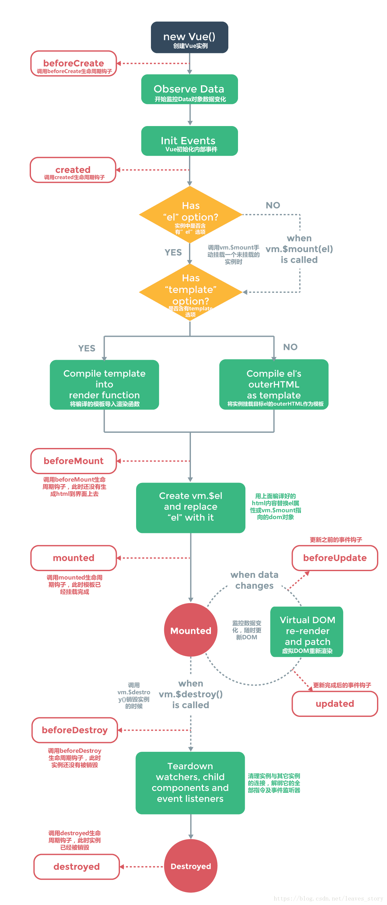

网易云音乐接口 <a>https://binaryify.github.io/NeteaseCloudMusicApi/#/</a>

* Vue基本语法

1. {{}} 插值表达式，插值表达式只能用于普通文本

2. 参数说明

```javascript
var app = new Vue({
        el:"#app",
        data:{
            message:"信息化台账"
        }
    });
```

​		el:挂载点

​		data:数据对象

3. vue的作用范围

   ​	Vue会话管理el选项命中的元素及其内部的后代元素

4. 是否可以设置使用其他选择器

   ​	id、class、标签等选择器均可，建议使用id选择器（id选择器唯一，不会造成语义不清）

5. 可以选择什么样的dom元素作为挂载点

   ​	除了body、html外的双标签元素，建议用div作为挂在点（因为其他元素会有默认样式）

* Vue指令

1. 内容绑定，事件绑定

   * v-text 设置标签的文本值

   ```javascript
   <h5 v-text="message">714</h5> //直接替换
   <h5>{{message}}714</h5> //插值
   ```

   * v-html
     1. 设置元素的innerHTML
     2. 会解析html标签
     3. v-text 只解析为文本
     
   * v-on

     1. 为元素绑定事件
     2. 事件名不需要写on
     3. 指令可以简写为@
     4. 绑带那个的方法定义再methods中
     
     ```javascript
     <div id="von">
          <input type="button" value="v-on" v-on:click="functionName"/>
          <input type="button" value="v-on简写" @click="functionName"/>
     </div>
     var von=new Vue({
         el:"#von",
         methods:{
             functionName(){
               alert("测试");
             }
         }
     })
     ```
     
     v-on 补充
     
     1. 事件绑定的方法写成函数调用形式，可以传入自定义参数
     2. 定义方法时需要定义形参接受传入的实参
     3. 事件的后面跟上.修饰符可以对事件进行限制（.enter 可以限制出发的按键为回车）
     4. 事件修饰符有很多<https://cn.vuejs.org/v2/api/#v-on>
       
     
     ```javascript
     <div id="von">
         <button @click="clickFunction(message,message2)">点击</button>
     	<input @keyup.enter="keyupfunction"/>
     </div>
     ```
     
     ```javascript
     var von = new Vue({
          el:"#von",
       data:{
              message:1,
              message2:2
          },
          methods:{
              clickFunction:function(p1,p2){
                  alert(p1+"/"+p2)
           },
              keyupfunction:function(){
                  alert(22);
              }
          }
      })
     ```
     
   * v-show

     根据表达式的真假，切换元素的显示隐藏

     1. 原理：修改元素的display实现显示隐藏

     2. 指令后面的内容，最终解析为布尔表达式

     3. 值为true显示 false隐藏

     ```html
      <div id="vshow">
           <button @click="changeShow">显示图标</button>
           <image src="http://www.bluewave.com.cn/template/91/4752.png" v-show="isShow"></image>
     </div>
     ```

     ```javascript
     var vshow = new Vue({
         el:"#vshow",
         data:{
             isShow:false
         },
         methods:{
             changeShow:function(){
                 this.isShow=!this.isShow;
             }
         }
     })
     ```

     

   * v-if 

     根据表达式的真假切换元素的显示状态
     
    1. 原理是通过操纵dom元素切换显示状态

     2. 表达式为true元素存在dom树中，表达式false从dom树中删除

     3. 频繁切换v-show,反之使用v-if，前者消耗小

   * v-bind

     为元素绑定属性

     1. 完整写法v-bind:属性名

     2. 简写省略v-bind,只保留 :属性名

     3. 需要动态的增删class建议使用对象的方式

   * v-for

     根据数据生成列表结构

     1. 数组经常v-for使用
     
     2. 语法是（item,index) in 数据
     
     3. item和index可以结合其他指令一起使用
     
     4. 数组的长度的更新会同步到也面上，是《响应式的
     
        ```javascript
        <div id="vfor">
            <ul>
             <li v-for="(item,index) in arr">{{index}}\{{item.name}}</li>
            </ul>
         <h3 v-for="item in arr2" v-text="item"></h3>
            <button @click="add">添加元素</button>
         <button @click="shift">移除元素</button>
        </div>
     var vfor = new Vue({
            el:"#vfor",
         data:{
                arr:[{name:"姓名"},{name:"姓名2"}],
             arr2:["西红柿","辣椒","角瓜"]
            },
         methods:{
                add:function(){
                 this.arr2.push("鸡蛋");
                },
             shift:function(){
                    this.arr2.shift();
             }
            }
        })
        ```
     
        <font color='red'>**v-for 中的:key，给标签设置一个标记，具体详细解释**</font>

   * v-model

     便捷的设置和获取表单元素的值

     1. 绑定的数据会和表单元素值相关联
     
     2. 绑定的数据《----------》表单元素的值（<font color='red'>双向绑定</font>）

      ```javascript
      <div id="vmodel">
          <input type="text" v-model="message" @keyup.enter="getMessage"/>
          <h3>{{message}}</h3>
      </div>
      var vmodel = new Vue({
          el:"#vmodel",
          data:{
              message:"message"
          },
          methods:{
              getMessage:function(){
                  alert(this.message)
              }
          }
      })
      ```

   

   * axios
     
     1. axios必须先导入才可以使用
     2. 使用get或post方法发送对应的请求
     3. then方法中的回调函数会在请求成功或失败时触发
     4. 通过回调函数的形参可以获取响应内容，或错误信息
     
   * watch

     侦听器

     ```javascript
     data() {
         return {
           //侦听对象
           tag:"全部",
           obj:{
               a:'',b:''
           }
         };
     },
     watch:{
         tag(newValue,oldValue){
           console.log(newValue+"  "+oldValue);
           //推荐音乐 精品歌单
           axios({
             url:"https://autumnfish.cn/top/playlist/highquality",
             methods:"get",
             params:{limit:1,cat:this.tag}
           }).then(res=>{
             //console.log(res);
             this.topList = res.data.playlists[0];
           })
       },
       obj(){
         console.log(this.obj.a)  
       },
       deep:true,//深度侦听 侦听对象属性变化
       immediate:true // watch侦听操作内的函数会立刻被执行
     }
     ```

   * 组件通信

     > 子传父
     >
     > ```javascript
     > //this.$parent获取父组件可以修改任意值
     > this.$parent.musicUrl = res.data.data[0].url;
     > ```
     >
     > 父传子
     >
  > 
   
   * 


**vue.js的生命周期函数执行流程**





