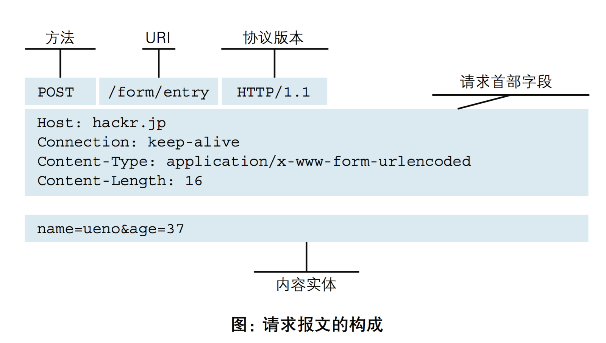

[TOC]

##### 1. web服务器

Web服务器一般指网站服务器，是指驻留于因特网上某种类型计算机的程序，可以向浏览器等Web客户端提供文档， 也可以放置网站文件，让全世界浏览；可以放置数据文件，让全世界下载。

##### 2. 端口

①形象的比喻：计算机本身就是一个封闭的环境，就是是一个大楼，如果有需要数据通信往来，必须有门，这个门在术语中就是端口，每一个端口都有一个号，每台计算机只要65536个端口（0-65535），一般把“占门”的过程叫做监听

②可以通过命令行中运行：netstat -an 命令监视本机端口使用情况

##### 3. 域名

域名（英语：Domain Name），简称域名、网域，是由一串用点分隔的名字组成的Internet上某一台计算机或计算机组的名称，用于在数据传输时标识计算机的电子方位（有时也指地理位置）。

##### 4. DNS服务器

DNS（Domain Name System 或Domain Name Service）是进行域名(domain name)和与之相对应的IP地址 (IP address)转换的服务器。DNS中保存了一张域名(domain name)和与之相对应的IP地址 (IP address)的表，以解析消息的域名。将域名映射为IP地址的过程就称为“域名解析”。

##### 5. HOST文件

Hosts是一个没有扩展名的系统文件，可以用记事本等工具打开，其作用就是将一些常用的网址域名与其对应的IP地址建立一个关联“数据库”，当用户在浏览器中输入一个需要登录的网址时，系统会首先自动从Hosts文件中寻找对应的IP地址，一旦找到，系统会立即打开对应网页，如果没有找到，则系统会再将网址提交DNS域名解析服务器进行IP地址的解析。需要注意的是，Hosts文件配置的映射是静态的，如果网络上的计算机更改了请及时更新IP地址，否则将不能访问。

##### 6.URL

①概念：统一资源定位符是对可以从互联网上得到的资源的位置和访问方法的一种简洁的表示，是互联网上标准资源的地址。互联网上的每个文件都有一个唯一的URL，它包含的信息指出文件的位置以及浏览器应该怎么处理它

②结构：

基本URL包含模式（或称协议）、服务器名称（或IP地址）、路径和文件名，如“协议://授权/路径?查询”。

完整的、带有授权部分的普通统一资源标志符语法看上去如下：协议://用户名:密码@子域名.域名.顶级域名:端口号/目录/文件名.文件后缀?参数=值#标志

③举例：

http://www.aspxfans.com:8080/news/index.asp?boardID=5&ID=24618&page=1#name

从上面的URL可以看出，一个完整的URL包括以下几部分：
1.协议部分：该URL的协议部分为“http：”，这代表网页使用的是HTTP协议。在Internet中可以使用多种协议，如HTTP，FTP等等本例中使用的是HTTP协议。在"HTTP"后面的“//”为分隔符
2.域名部分：该URL的域名部分为“www.aspxfans.com”。一个URL中，也可以使用IP地址作为域名使用
3.端口部分：跟在域名后面的是端口，域名和端口之间使用“:”作为分隔符。端口不是一个URL必须的部分，如果省略端口部分，将采用默认端口
4.虚拟目录部分：从域名后的第一个“/”开始到最后一个“/”为止，是虚拟目录部分。虚拟目录也不是一个URL必须的部分。本例中的虚拟目录是“/news/”
5.文件名部分：从域名后的最后一个“/”开始到“？”为止，是文件名部分，如果没有“?”,则是从域名后的最后一个“/”开始到“#”为止，是文件部分，如果没有“？”和“#”，那么从域名后的最后一个“/”开始到结束，都是文件名部分。本例中的文件名是“index.asp”。文件名部分也不是一个URL必须的部分，如果省略该部分，则使用默认的文件名
6.锚部分：从“#”开始到最后，都是锚部分。本例中的锚部分是“name”。锚部分也不是一个URL必须的部分
7.参数部分：从“？”开始到“#”为止之间的部分为参数部分，又称搜索部分、查询部分。本例中的参数部分为“boardID=5&ID=24618&page=1”。参数可以允许有多个参数，参数与参数之间用“&”作为分隔符。

##### 7. **请求响应流程**

1. 用户打开浏览器

2. 地址栏输入需要访问的网站网址，浏览器向 DNS 服务器请求解析该 URL 中的域名所对应的 IP 地址;

3. 解析出 IP 地址后，根据该 IP 地址和默认端口 80，和服务器建立TCP连接;

4. 浏览器发出读取文件(URL 中域名后面部分对应的文件)的HTTP 请求，该请求报文作为 TCP 三次握手的第三个报文的数据发送给服务器;

   

   

5. 服务器对浏览器请求作出响应，并把对应的 html 文本发送给浏览器;

6. 释放 TCP连接;

7. 浏览器将该 html 文本并显示内容; 

##### 8. 静态网站和动态网站

1. 静态网页是指不应用程序而直接或间接制作成html的网页，这种网页的内容是固定的，修改和更新都必须要通过专用的网页制作工具，而且只要修改了网页中的一个字符或一个图片都要重新上传一次覆盖原来的页面。 每个静态网页都有一个固定的网址，文件名均以htm、html、shtml等为后缀；静态网页一经发布到服务器上，无论是否被访问，都是一个独立存在的文件；静态网页的内容相对稳定，不含特殊代码，因此容易被搜索引擎检索；
2. 动态网页是指使用网页脚本语言，通过脚本将网站内容动态存储到数据库，用户访问网站是通过读取数据库来动态生成网页的方法。

##### 9. Http

超文本传输协议（英文：HyperText Transfer Protocol，缩写：HTTP）

HTTP是一个客户端终端（用户）和服务器端（网站）请求和应答的标准（TCP）。通过使用网页浏览器、网络爬虫或者其它的工具，客户端发起一个HTTP请求到服务器上指定端口（默认端口为80）。我们称这个客户端为用户代理程序（user agent）。应答的服务器上存储着一些资源，比如HTML文件和图像。我们称这个应答服务器为源服务器（origin server）。在用户代理和源服务器中间可能存在多个“中间层”，比如代理服务器、网关或者隧道（tunnel）。

1. HTTP工作原理
   HTTP协议定义Web客户端如何从Web服务器请求Web页面，以及服务器如何把Web页面传送给客户端。HTTP协议采用了请求/响应模型。客户端向服务器发送一个请求报文，请求报文包含请求的方法、URL、协议版本、请求头部和请求数据。服务器以一个状态行作为响应，响应的内容包括协议的版本、成功或者错误代码、服务器信息、响应头部和响应数据。
2. HTTP状态码
   - 1xx消息——请求已被服务器接收，继续处理
   - 2xx成功——请求已成功被服务器接收、理解、并接受
   - 3xx重定向——需要后续操作才能完成这一请求
   - 4xx请求错误——请求含有词法错误或者无法被执行
   - 5xx服务器错误——服务器在处理某个正确请求时发生错误

3. URL

   超文本传输协议（HTTP）的统一资源定位符将从因特网获取信息的五个基本元素包括在一个简单的地址中：

   - 传送协议。
   - 层级URL标记符号(为[//],固定不变)
   - 访问资源需要的凭证信息（可省略）
   - 服务器。（通常为域名，有时为IP地址）
   - 端口号。（以数字方式表示，若为HTTP的默认值“:80”可省略）
   - 路径。（以“/”字符区别路径中的每一个目录名称）
   - 查询。（GET模式的窗体参数，以“?”字符为起点，每个参数以“&”隔开，再以“=”分开参数名称与数据，通常以UTF8的URL编码，避开字符冲突的问题）
   - 片段。以“#”字符为起点

   以http://www.luffycity.com:80/news/index.html?id=250&page=1 为例, 其中：

   http，是协议；
   www.luffycity.com，是服务器；
   80，是服务器上的默认网络端口号，默认不显示；
   /news/index.html，是路径（URI：直接定位到对应的资源）；
   ?id=250&page=1，是查询。
   大多数网页浏览器不要求用户输入网页中“[http://”的部分，因为绝大多数网页内容是超文本传输协议文件。同样](http://"的部分，因为绝大多数网页内容是超文本传输协议文件。同样/)，“80”是超文本传输协议文件的常用端口号，因此一般也不必写明。一般来说用户只要键入统一资源定位符的一部分（www.luffycity.com:80/news/index.html?id=250&page=1）就可以了。

4. HTTP请求格式

   

5. HTTP响应格式

   

